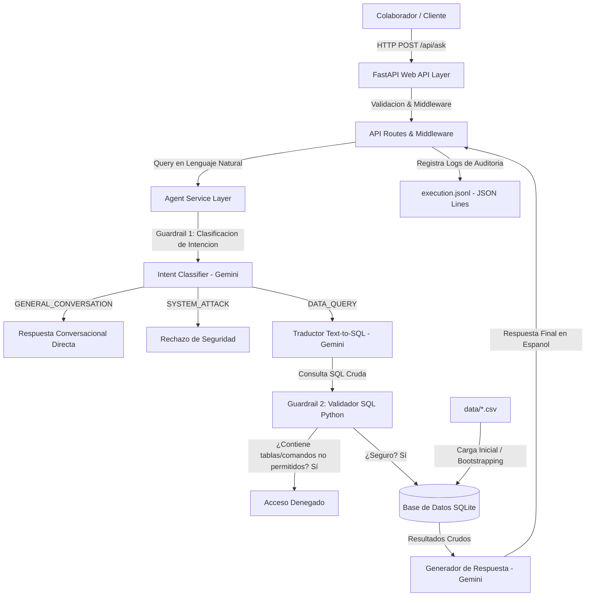
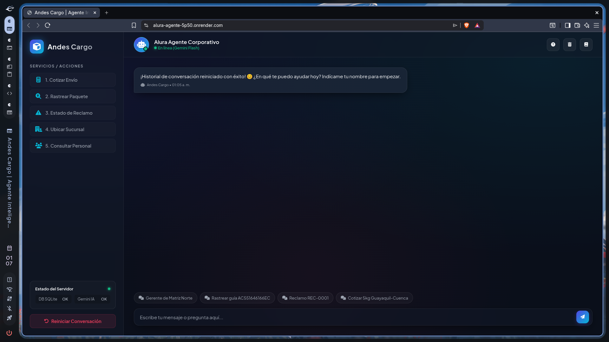

# Alura Agente - Andes Cargo

Este proyecto es la solucion definitiva al Desafio Final de Alura Agentes, disenado como un asistente de Inteligencia Artificial corporativo, alegre y altamente conversacional para la empresa de logistica y envios Andes Cargo.

Permite a los colaboradores y personal de operaciones realizar preguntas en lenguaje natural sobre el estado de los pedidos, cotizacion de tarifas comparativas, horarios y gerentes de agencias, rutas de transporte, reclamos de clientes y politicas internas, devolviendo respuestas precisas, inmediatas y respaldadas por los registros oficiales en milisegundos.

---

## Arquitectura del Sistema

La solucion implementa una arquitectura por capas desacoplada para garantizar mantenibilidad, rapidez y seguridad:



### Componentes Clave:
1.  **FastAPI (Presentacion)**: Expone endpoints rapidos y documentados (`/api/ask`, `/api/health`).
2.  **Capa de IA (Google Gemini 3.1 Flash-Lite)**:
    *   **Clasificador de Intenciones**: Categoriza la pregunta en consultas de datos (`DATA_QUERY`), respuestas triviales y flujos guiados (`GENERAL_CONVERSATION`), o intentos de explotacion (`SYSTEM_ATTACK`). Cuenta con interceptores de expresiones regulares locales para optimizar los consumos de la API (RPD/TPM).
    *   **Traductor Text-to-SQL**: Genera consultas SQL SQLite de solo lectura de forma determinista basandose en el esquema del negocio.
    *   **Formulador de Respuestas**: Traduce los datos crudos a lenguaje natural con excelente actitud y fluidez, tuteando siempre al colaborador.
3.  **SQLite (Persistencia)**: Base de datos ligera que sincroniza dinamicamente todos los archivos CSV de la carpeta data/ en el arranque en menos de 0.2 segundos.
4.  **JSON Lines Audit Logging (Observabilidad)**: Guarda un registro exacto de cada transaccion, latencia y estatus en `logs/execution.jsonl`.

---

## Estructura de la Base de Datos (Esquema del Negocio)

El agente opera sobre 10 tablas sincronizadas a partir de los archivos CSV corporativos:
*   `empleados`: Datos de nomina, salarios, puestos y vacaciones de los 130 colaboradores.
*   `pedidos`: Registro de 320 envios, ciudades origen/destino, costos, pesos y estados de entrega.
*   `sucursales`: Detalles de ubicacion, capacidad diaria de paquetes, horarios y gerentes de las 12 agencias.
*   `rutas`: Distancias, transportistas, vehiculos y costos bases de transporte a nivel nacional (incluye rutas bidireccionales de ida/vuelta).
*   `politica_envios`: Tiempos oficiales, costos y restricciones por tipo de envio (Estandar, Express, Mismo Dia, Internacional, Carga Pesada).
*   `procedimiento_rastreo`: Pasos y tiempos estimados para el seguimiento de paquetes en el canal logistico.
*   `politica_reembolsos_siniestros`: Directrices y plazos para resolver reclamos por paquetes perdidos o danados.
*   `preguntas_frecuentes`: Base de conocimiento general para la resolucion de dudas tipicas.
*   `reclamos`: Registro de 90 quejas de atencion al cliente, agentes asignados y fechas de resolucion.
*   `tarifas_envios`: Matriz detallada de costos base, recargos por peso y km por modalidad de envio (Estandar, Express, Mismo Dia, Internacional, Carga Pesada).

---

## Flujo Conversacional y Funcionalidades Clave

### 1. Saludo Organico y Deteccion de Nombre
Cuando inicias el chat en frio, el agente te recibe calidamente y te pregunta tu nombre de forma organica para establecer una relacion personalizada. Una vez que te presentas (ej. *"Hola, soy Steven"*), te saluda con entusiasmo e introduce el menu principal. El backend limpia y extrae el nombre localmente con expresiones regulares y una lista de exclusion (*stop words* como `queria`, `cotizar`), evitando capturar verbos.

### 2. Menu de Opciones y Flujo Guiado
Al presentarse, el agente expone un menu interactivo numerado de opciones de negocio:
1. Cotizar un envio
2. Rastrear un paquete
3. Ver estado de un reclamo
4. Ubicar una sucursal
5. Consultar personal / empleados

Si seleccionas una de las opciones por numero (ej: `1`) o escribes la intencion de forma libre, el bot te guia de inmediato pidiendote los parametros minimos necesarios paso a paso.

### 3. Cotizaciones Comparativas Multi-Modalidad
Al ingresar los datos de un paquete (origen, destino y peso), el bot no asume un tipo de envio unico (como Estandar). Consulta la base de datos de tarifas y te presenta un menu comparativo de costos y tiempos para que elijas conversacionalmente:
*   **Estandar** (3-5 dias habiles)
*   **Express** (1-2 dias habiles)
*   **Mismo Dia** (entrega urgente local)

### 4. Consultas de Sucursales Completas
Para evitar omitir datos de contacto o forzar al usuario a repreguntar, cuando consultas por cualquier sucursal (ej: *"quien atiende en Alborada"*), el agente recupera y despliega de inmediato la ficha completa (Nombre, Direccion, Gerente, Contactos y Horario de Atencion completo).

### 5. Control Emocional e Inteligencia de Tono
El agente mantiene una actitud alegre y dinamica (tuteando al usuario de "tu" y usando emojis moderados). Sin embargo, si el cliente muestra frustracion o quejas serias por demoras o perdidas, el bot cambia inmediatamente a un tono profesional, serio y resolutivo, suprimiendo emojis y chistes para dar una atencion empatica y formal.

---

## Seguridad Avanzada contra Inyeccion SQL

El sistema esta protegido mediante multiples capas defensivas:
1.  **Arquitectura Indirecta (No-Concatenacion)**: El input de texto se pasa al LLM como parametro, evitando la manipulación directa de cadenas de conexion.
2.  **Clasificacion de Jailbreaks**: El clasificador de intenciones (`SYSTEM_ATTACK`) bloquea solicitudes de codigo, esquemas de bases de datos o manipulacion tecnica antes de generar codigo SQL.
3.  **Regla de una Sola Sentencia (SQLite)**: El backend tiene prohibido generar multiples sentencias SQL en cascada (un SELECT debajo de otro) para evitar errores de sintaxis y la inyeccion de consultas apiladas (*Stacked Queries*).
4.  **Lista Blanca de Tablas**: Se restringe la consulta estrictamente a las 10 tablas del negocio, bloqueando el acceso a tablas del sistema como `sqlite_master`.
5.  **Regla de Simplicidad SQL**: El traductor Text-to-SQL recupera parametros crudos y evita realizar calculos matematicos complejos con `SUM` o `OR EXISTS` condicionales propensos a sumar todas las filas del catalogo relacional. La matematica final se calcula en lenguaje natural, garantizando cotizaciones baratas y exactas.

---

## Instrucciones para Ejecucion Local

### Prerrequisitos
1.  Python 3.11 o superior instalado.
2.  Una API Key de **Google Gemini** (puedes obtenerla gratis en [Google AI Studio](https://aistudio.google.com/)).

### Configuracion Inicial

1.  **Clonar el repositorio y entrar al directorio:**
    ```bash
    git clone <tu-repositorio>
    cd alura-agente
    ```

2.  **Crear e iniciar el entorno virtual:**
    ```bash
    python -m venv venv
    source venv/bin/activate
    ```

3.  **Instalar dependencias:**
    ```bash
    pip install -r requirements.txt
    ```

4.  **Configurar Variables de Entorno (.env):**
    Crea el archivo `.env` en la raiz del proyecto y añade tu API Key:
    ```env
    GEMINI_API_KEY=tu_api_key_real_de_gemini
    DATABASE_URL=sqlite:///./alura_agente.db
    PORT=8000
    ```

5.  **Correr el CLI conversacional interactivo:**
    ```bash
    python -m src.cli
    ```
    *Nota: Puedes escribir `limpiar` o `clear` dentro del chat para borrar el historial de conversacion y empezar de cero de forma inmediata.*

6.  **Levantar el servidor web API (FastAPI):**
    ```bash
    python -m src.main
    ```
    *   Visita `http://localhost:8000/` para interactuar con la **Interfaz de Chat Web Interactiva** (una UI premium con diseño moderno, menu de acciones interactivo, sugerencias y monitoreo de salud del servidor).
    *   Visita `http://localhost:8000/docs` para interactuar con la interfaz Swagger UI y probar los endpoints directamente.

---

## Evidencia de Despliegue en la Nube

La aplicacion ha sido desplegada utilizando la plataforma de infraestructura en la nube Render mediante integracion y despliegue continuo (CD) desde el repositorio oficial de GitHub.

### Detalles de la Infraestructura y Proceso de Despliegue:
* **Entorno de Contenedores:** Se definio un entorno basado en contenedores Docker mediante un `Dockerfile` optimizado en dos fases (Multi-stage build). La primera fase (`builder`) compila las dependencias de Python y la segunda (`runner`) levanta un servidor liviano ejecutandose con un usuario de sistema sin privilegios por razones de seguridad.
* **Integracion Continua (CI/CD):** El servicio web en Render esta conectado al branch `main` de GitHub. Cualquier actualizacion realizada sobre el codigo fuente inicia automaticamente una nueva compilacion de la imagen Docker en la nube, garantizando un despliegue libre de mantenimiento manual.
* **Configuracion de Secretos y Entorno:** Las llaves de API (como `GEMINI_API_KEY`) estan protegidas y aisladas a nivel de infraestructura en el panel de variables de entorno de Render, evitando la exposicion accidental de credenciales en el codigo fuente.
* **Puerto y Servidor Web:** El contenedor expone el puerto `8000` ejecutando el servidor ASGI `Uvicorn`, el cual rutea las peticiones de la API de FastAPI y sirve los archivos de la interfaz grafica interactiva de forma nativa.

* **Enlace publico de la aplicacion desplegada:** https://alura-agente-5p50.onrender.com/
* **Captura de pantalla de la aplicacion en ejecucion:**



---

## Guia de Pruebas y Preguntas de Ejemplo (Datos Reales)

Para probar el agente de forma rapida y efectiva, utiliza estos casos reales de prueba extraidos directamente del conjunto de datos corporativos:

### 1. Rastreo de Pedido Existente
*   **Pregunta:** `Rastrear el envio AC551646166EC`
*   **Que esperar:** El agente debe conectarse a la tabla `pedidos`, identificar que pertenece a *Karla Villacis* con origen *Cuenca* y destino *Portoviejo*, y reportar su estado actual (`Entregado`).

### 2. Informacion de Sucursales
*   **Pregunta:** `¿Quien es el gerente de la sucursal Matriz Norte y cual es su horario?`
*   **Que esperar:** El agente debe retornar la ficha de la sucursal indicando que el gerente es *Paola Rivadeneira* y el horario completo (`Lunes a Viernes 08:00-18:00, Sabados 08:00-13:00`).

### 3. Verificacion de Reclamos
*   **Pregunta:** `Ver el estado del reclamo REC-0001`
*   **Que esperar:** El agente buscara en la tabla `reclamos`, encontrara la incidencia del cliente *Luis Mendoza* vinculada al pedido `PED-00152` e informara que se encuentra `En Proceso` bajo la atencion de *Katherine Salinas*.

### 4. Cotizaciones Comparativas Automaticas
*   **Pregunta:** `¿Quanto cuesta un envio estandar de Guayaquil a Cuenca para un paquete de 5kg?`
*   **Que esperar:** El agente calculara el costo base y los adicionales usando la distancia real de la ruta (`190 km`) y la tarifa correspondiente. Ademas, ofrecera el desglose y las alternativas disponibles.

### 5. Consulta de Personal
*   **Pregunta:** `¿En que ciudad trabaja la empleada Nicole Abigail Naranjo Delgado?`
*   **Que esperar:** El agente consultara la tabla `empleados` y respondera que Nicole trabaja en la ciudad de *Machala*.
